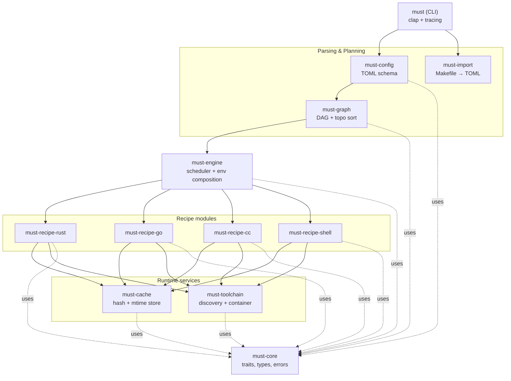
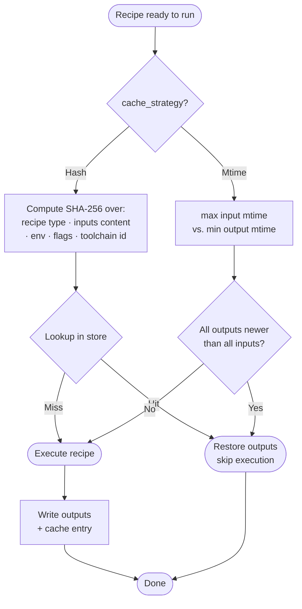
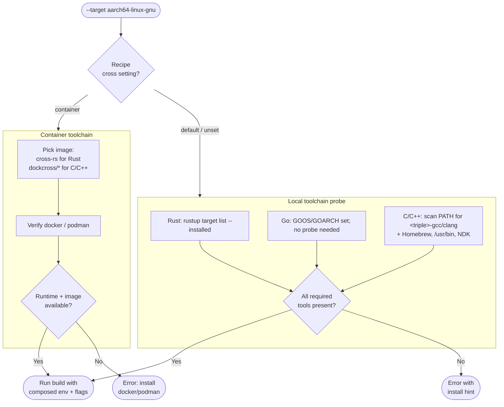
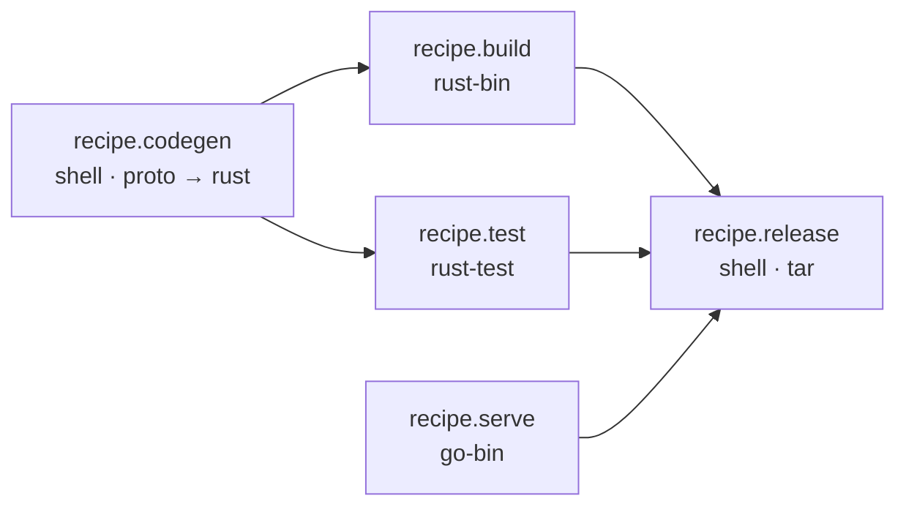

# Mustfile — Technical Design

This document describes the architecture, abstractions, and execution model of Mustfile. Diagrams are written in Mermaid and render natively on GitHub.

## Goals

1. **One binary, one config.** A single `must` binary reads a `Mustfile.toml` at the project root.
2. **Consistent verbs across languages.** `must build` / `must test` / `must release` work the same way regardless of which language(s) the project uses.
3. **First-class language modules.** Mustfile *understands* Rust, Go, and C/C++ — toolchains, cross-compile triples, linkers, and common env vars are wired up automatically.
4. **Generic escape hatch.** Shell recipes cover anything not covered by a first-class module.
5. **Pragmatic caching.** Hash-based for first-class recipes (reproducible, branch-switch-safe). Mtime for shell recipes, with opt-in to hashing.
6. **Migration path from Make.** A best-effort one-shot converter (`must import`).

## Non-goals (v1)

- Bazel-style hermetic, fully sandboxed builds.
- Replacing language-native toolchains (Mustfile drives `cargo`, `go`, `clang`/`gcc`; it does not invoke `rustc` directly).
- Auto-provisioning C/C++ cross-toolchains (deferred to v0.2+).
- A new scripting DSL — recipe bodies are plain shell.
- GNU Make runtime emulation. The v1 import is one-shot translation; runtime `-f Makefile` mode is a v0.2+ feature.

## Locked design decisions

| Area | Decision |
|---|---|
| Philosophy | Hybrid: smart task runner with build-system escape hatches per language module |
| Config format | TOML (`Mustfile.toml`) + shell/script recipe blocks |
| Makefile compatibility | v1: one-shot converter (`must import`). v0.2+: runtime `-f Makefile` execution |
| First-class languages (v1) | Rust, Go, C/C++ |
| Cross-toolchain model | BYO default + container opt-in (`cross = "container"`); auto-provision in v0.2+ |
| Caching | Content-hash for first-class recipes; mtime for shell recipes (opt-in to hash) |

---

## High-level architecture



Each box is a Cargo crate. `must-core` is the shared types/traits crate every other crate depends on. The CLI is the only binary; everything else is a library.

## Workspace / crate layout

```
must/

├── Mustfile.toml             # dogfood: build must with must
├── docs/                     # this directory
└── crates/
    ├── must-cli/             # binary; clap + tracing + entry point
    ├── must-config/          # TOML schema, serde model, validation
    ├── must-graph/           # DAG, topo sort, cycle detection
    ├── must-engine/          # scheduler, env composition, parallel execution
    ├── must-cache/           # content-hash + mtime cache, on-disk store
    ├── must-toolchain/       # toolchain discovery, container exec
    ├── must-recipe-rust/     # rust-bin, rust-lib, rust-test
    ├── must-recipe-go/       # go-bin, go-test
    ├── must-recipe-cc/       # c-bin, c-lib (clang/gcc + sysroots)
    ├── must-recipe-shell/    # generic shell with mtime + opt-in hash
    ├── must-import/          # Makefile parser + translator
    └── must-core/            # shared types, error enum, traits
```

---

## Configuration schema

A single `Mustfile.toml` at the project root. Annotated example:

```toml
# ── Project metadata ───────────────────────────────────────────────────
[project]
name = "myapp"
version = "0.1.0"

# ── Environment variables ──────────────────────────────────────────────
[env]
RUST_LOG = "info"

[env.release]                   # profile-scoped overrides; merged on top
RUST_LOG = "warn"

# ── Cross-compile target groups ────────────────────────────────────────
[targets]
default = ["x86_64-linux-gnu"]
release = [
  "x86_64-linux-gnu",
  "aarch64-linux-gnu",
  "x86_64-apple-darwin",
  "aarch64-apple-darwin",
]

# ── First-class recipe (Rust) ──────────────────────────────────────────
[recipe.build]
type     = "rust-bin"
package  = "myapp"
features = ["cli"]

# ── First-class recipe (Go) ────────────────────────────────────────────
[recipe.serve]
type    = "go-bin"
package = "./cmd/server"
ldflags = "-s -w"

# ── Generic shell recipe with explicit inputs/outputs ──────────────────
[recipe.codegen]
type    = "shell"
inputs  = ["proto/**/*.proto"]
outputs = ["src/generated/**/*.rs"]
cache   = "hash"                 # opt-in to content hashing
script  = """
protoc --rust_out=src/generated proto/*.proto
"""

# ── Recipe with dependencies ───────────────────────────────────────────
[recipe.release]
type   = "shell"
deps   = ["build", "test"]
script = "tar czf myapp.tar.gz target/release/myapp"

# ── Per-target overrides ───────────────────────────────────────────────
[recipe.build.cross]
"aarch64-linux-gnu" = { linker = "aarch64-linux-gnu-gcc", cross = "container" }
```

### Env precedence (lowest → highest)

1. Process environment (inherited from the user's shell).
2. `[env]` global table.
3. `[env.<profile>]` for the active profile (`--profile`).
4. `[recipe.<name>.env]` per-recipe overrides.
5. Toolchain-injected vars (`CC`, `AR`, `LD`, `CFLAGS`, `GOOS`, `GOARCH`, etc.).

Each later layer wins on conflict.

---

## Core abstractions

All defined in `must-core`. Every crate depends on this one and nothing else from the workspace (except the CLI, which depends on everything).

### `Recipe` trait

```rust
pub trait Recipe: Send + Sync {
    fn name(&self) -> &str;
    fn deps(&self) -> &[String];
    fn inputs(&self, ctx: &BuildContext)  -> Result<Vec<PathBuf>>;
    fn outputs(&self, ctx: &BuildContext) -> Result<Vec<PathBuf>>;
    fn cache_strategy(&self) -> CacheStrategy;     // Hash | Mtime
    fn cache_key(&self, ctx: &BuildContext) -> Result<CacheKey>;
    fn execute(&self, ctx: &BuildContext) -> Result<RecipeOutput>;
}
```

Each language module implements `Recipe` for its types and registers them with the engine via a `RecipeRegistry` keyed by the `type = "..."` field in TOML.

### `Toolchain` trait

```rust
pub trait Toolchain: Send + Sync {
    fn target_triple(&self) -> &str;
    fn cc(&self)     -> Option<&Path>;
    fn linker(&self) -> Option<&Path>;
    fn env(&self)    -> HashMap<String, String>;     // CC, AR, LD, CFLAGS, ...
    fn execute(&self, cmd: Command) -> Result<Output>;
}
```

Two implementations in v1:

- `LocalToolchain` — runs commands directly on the host (BYO).
- `ContainerToolchain` — wraps `docker run` / `podman run` with a bind-mounted project root and a pre-built image (`cross-rs/cross` for Rust, `dockcross/*` for C/C++).

### `Cache` trait

```rust
pub trait Cache: Send + Sync {
    fn lookup(&self, key: &CacheKey) -> Result<CacheLookup>;  // Hit | Miss | Stale
    fn store(&self,  key: &CacheKey, outputs: &[PathBuf]) -> Result<()>;
    fn invalidate(&self, key: &CacheKey) -> Result<()>;
}
```

Storage layout: `.must/cache/<sha256-prefix>/<sha256-rest>/` with a sled index of `(recipe, target, profile) → CacheKey` for `must --explain`.

---

## Execution flow

```mermaid
sequenceDiagram
    actor User
    participant CLI as must-cli
    participant Cfg as must-config
    participant Graph as must-graph
    participant Eng as must-engine
    participant TC as must-toolchain
    participant Cache as must-cache
    participant Rcp as Recipe (rust/go/cc/shell)

    User->>CLI: must build --target aarch64-linux-gnu --profile release
    CLI->>Cfg: load Mustfile.toml
    Cfg->>Cfg: apply profile overrides; validate
    Cfg-->>CLI: Config
    CLI->>Graph: build DAG from `build` + deps
    Graph->>Graph: topo sort, detect cycles
    Graph-->>CLI: Plan (waves of nodes)
    CLI->>TC: resolve target triple
    TC-->>CLI: Toolchain (Local or Container)
    CLI->>Eng: execute(Plan, Toolchain)

    loop for each wave (parallel within)
        Eng->>Rcp: cache_key(ctx)
        Rcp-->>Eng: key
        Eng->>Cache: lookup(key)
        alt Cache hit
            Cache-->>Eng: Hit (restore outputs)
        else Miss or Stale
            Eng->>Rcp: execute(ctx)
            Rcp->>TC: run command(s)
            TC-->>Rcp: Output
            Rcp-->>Eng: RecipeOutput
            Eng->>Cache: store(key, outputs)
        end
    end

    Eng-->>CLI: ExecutionReport (built / cached / wall time)
    CLI-->>User: summary
```

### Parallelism model

- The engine uses Tokio with a semaphore sized to `-j N` (default = `num_cpus`).
- Each wave (a topological layer of the DAG) is executed concurrently up to the semaphore limit.
- A failed recipe cancels the wave; in-flight recipes are allowed to finish (graceful) unless `--fail-fast` is set.

---

## Caching model



Hash inputs intentionally include the toolchain identity (e.g. `rustc -V` output, `go version`, `clang --version`) so that switching toolchains invalidates affected recipes.

---

## Cross-compile model



The error path is a first-class concern: when a toolchain is missing, Mustfile prints the exact command to install it (e.g. `rustup target add aarch64-linux-gnu`, `apt install gcc-aarch64-linux-gnu`, `brew install --cask docker`).

---

## Makefile import (`must import`)

Best-effort one-shot translation. Goal: cover ~80% of common Makefiles cleanly, flag the rest with explicit `# TODO must:` comments rather than guessing.

```mermaid
flowchart LR
    M([Makefile]) --> T[Tokenize<br/>logos]
    T --> P[Parse<br/>nom into AST]
    P --> A{For each AST node}

    A -- Variable assignment --> Ev[→ env table]
    A -- Simple rule --> Sr["[recipe.&lt;name&gt;]<br/>type = shell"]
    A -- Phony target --> Ph[phony = true]
    A -- "$&#40;shell ...&#41;" --> Sh["inline $&#40;...&#41; in script"]
    A -- Pattern rule --> Td["# TODO must:<br/>preserve original"]
    A -- include / eval / define --> Td

    Ev --> O[Mustfile.toml]
    Sr --> O
    Ph --> O
    Sh --> O
    Td --> O
    Td --> R[MUSTFILE_IMPORT_REPORT.md]
    A --> R
```



**Out of scope for v1:**
- Full GNU Make expansion semantics (secondary expansion, `eval`, complex `define` blocks).
- Pattern rules (`%.o: %.c`) — flagged for human review.
- `$(call ...)` user functions — flagged.

**Library choice:** `logos` for the lexer + `nom` for the parser, scoped to the constructs above. Keeps the dependency surface small and avoids pulling in Make-runtime emulators.

---

## Example DAG

The DAG produced from a typical project, demonstrating wave-based parallel execution:



Wave 1: `codegen`, `serve` (independent → parallel).
Wave 2: `build`, `test` (both depend on `codegen` → parallel).
Wave 3: `release` (waits on all).

---

## CLI surface

```text
must build [TARGET]...           # default recipe = "build"
must test  [TARGET]...
must run   RECIPE [-- ARGS...]
must <recipe-name> [ARGS]        # any recipe is callable directly
must list                        # show all recipes + types + deps
must graph                       # print DAG (text or DOT)
must clean [--cache]             # remove outputs (and optionally cache)
must import [--makefile PATH]    # generate Mustfile.toml from a Makefile
must doctor                      # check toolchains, containers, cache health

Flags (apply to most commands):
  --target TRIPLE         # cross-compile (multi-allowed)
  --profile NAME          # apply [env.<profile>] overrides
  -j N                    # parallelism (default = num_cpus)
  --dry-run               # plan without executing
  --explain RECIPE        # show why a recipe will/won't rebuild
  --fail-fast             # cancel in-flight recipes on first failure
  -v / -vv / -vvv         # tracing verbosity
```

## Error handling philosophy

- Every error variant in `must-core::Error` carries actionable context (path, line, suggested fix where possible).
- Toolchain-missing errors print the install command for the user's OS.
- Recipe failures preserve the full command line, env (sanitized), and exit code.
- `must --explain RECIPE` is the user-facing debug tool: it prints the cache key inputs, what changed, and the chosen toolchain.

## Concurrency model

- Tokio multi-thread runtime in the CLI; the engine uses `tokio::task::spawn_blocking` for synchronous tool invocations.
- Bounded by a `Semaphore(j)`. The DAG scheduler walks layer-by-layer; within a layer all recipes are dispatched concurrently up to the semaphore limit.
- Graceful shutdown on `SIGINT`: the engine signals all running recipe processes (`kill -TERM`), waits up to a configurable grace period, then `SIGKILL`s.

## Where to go next

- [`OVERVIEW.md`](./OVERVIEW.md) — high-level intro and quick example.
- [`TASKS.md`](./TASKS.md) — milestone-by-milestone task list.
- [`SCRATCHPAD.md`](./SCRATCHPAD.md) — open questions, alternatives considered.
