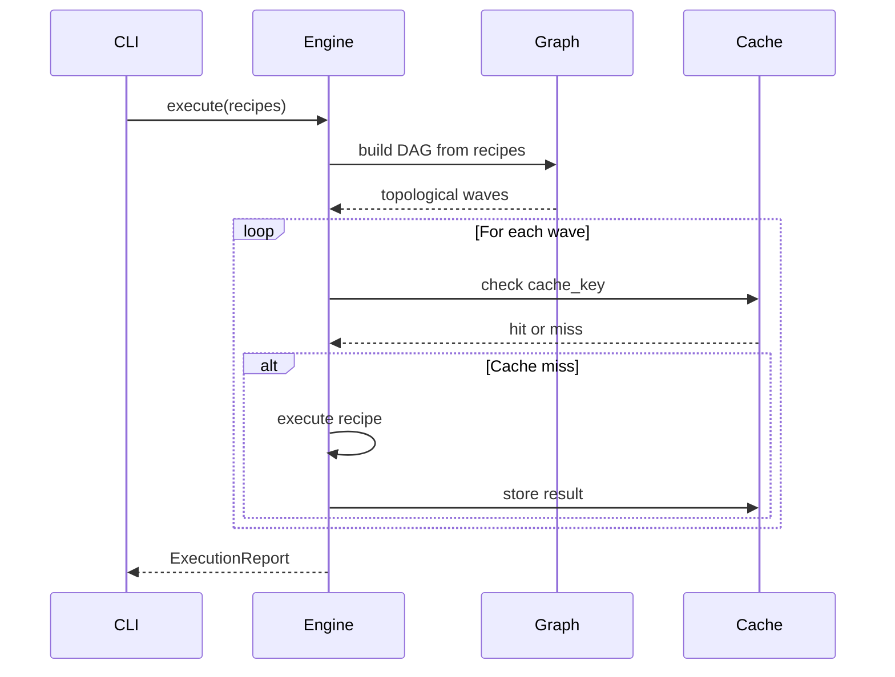

# Architecture

must is organized as a Rust workspace with 26 crates, each with a single responsibility.

## Crate layout

```
must-core/         Core types: Recipe trait, BuildContext, Error, run_command
must-cache/        Disk cache: DiskCache, CacheKey, compute_hash
must-config/       TOML config parsing, validation, 41 RecipeType variants
must-graph/        DAG construction, topological sort, parallel waves
must-engine/       Scheduler, execution engine, progress events
must-plugin/       Lua plugin runtime + stdlib (10 functions)
must-import/       Foreign config import (Makefile, package.json)
must-toolchain/    Cross-compilation, target triples, containers
must-recipe-*      Per-language recipe implementations (17 crates)
must-cli/          CLI binary, all commands, integration tests
```

## Core abstractions

### `Recipe` trait

Every recipe implements this trait (defined in `must-core`):

```rust
trait Recipe {
    fn name(&self) -> &str;
    fn deps(&self) -> &[String];
    fn inputs(&self, ctx: &BuildContext) -> Result<Vec<PathBuf>>;
    fn outputs(&self, ctx: &BuildContext) -> Result<Vec<PathBuf>>;
    fn cache_strategy(&self) -> CacheStrategy;
    fn cache_key(&self, ctx: &BuildContext) -> Result<CacheKey>;
    fn execute(&self, ctx: &BuildContext) -> Result<RecipeOutput>;
}
```

### `BuildContext`

Passed to every recipe execution:

```rust
struct BuildContext {
    project_root: PathBuf,
    cache_dir: PathBuf,
    log_dir: PathBuf,
    target: String,
    profile: String,
    env: HashMap<String, String>,
    dry_run: bool,
    parallelism: usize,
}
```

### `CacheStrategy`

```rust
enum CacheStrategy {
    Hash,    // content-hash of inputs
    Mtime,   // modification time
    Never,   // always re-run
}
```

## Execution flow



## Dependency resolution

1. Parse `Mustfile.toml` → `Config`
2. Build DAG from recipe `deps`
3. Topological sort → waves of parallelizable recipes
4. Each wave executes concurrently (bounded by `parallelism`)
5. Cache check happens before each recipe execution

## Caching model

- **Hash**: SHA-256 of (recipe_name, type, input file contents, env, toolchain version, flags)
- **Mtime**: Compare input file mtimes against last build
- **Never**: Test recipes always re-run

Cache is stored on disk via `sled` embedded database in `.mustfile/cache/`.

## Cross-compilation

Target triples are resolved per-recipe:

1. `--target` flag or `[targets]` group
2. Per-recipe `cross` overrides (linker, container)
3. Language-specific behavior (GOOS/GOARCH for Go, --target for Rust, cross-compiler for C)
